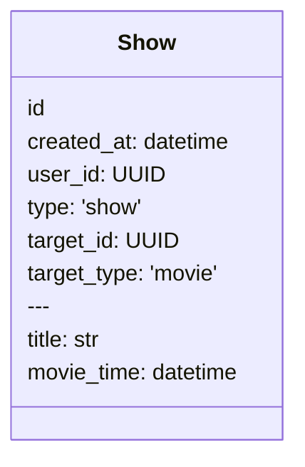
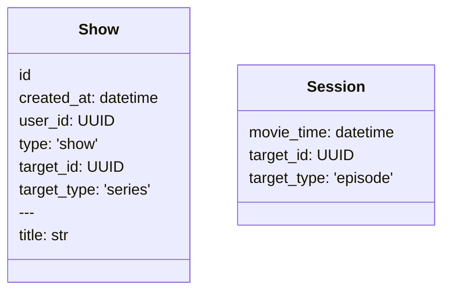
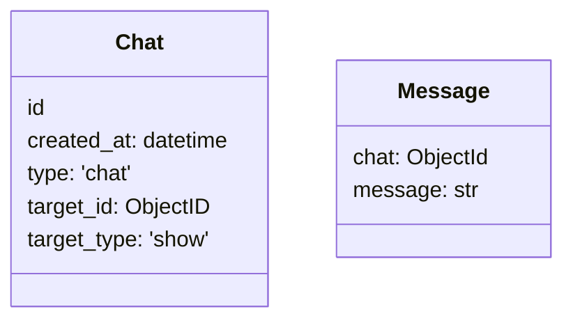
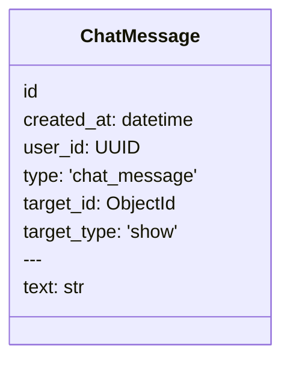

# Совместный просмотр

## MVP

- Планирование совместного просмотра: назначить
время, выбрать фильм, и получить ссылку на этот сеанс.
(Новый end-point в сервисе UGC.)

- Одновременный старт фильма. Кинотеатр стартует. Для 
опоздавшего зрителя он проматывает фильм на столько времени,
на сколько опоздал зритель. Это средствами фронт-энда.
    - Создается стрим, и сервер отдает кадры.
    - Видео отдается по запросу. Можно перематывать 
      вперед-назад.

## Части

Нужно создать сеанс `Session`, чтобы получить ссылку, по которой
приглашать друзей на совместный просмотр. 

Для фильмов:

Выглядит очень похоже на модели UGC. И в истории просмотров
должно отображаться. 

Для сериалов:

## Чат

Чат как сущность: создатель-админ, гости. То есть,
пользователи и их роли.

A)

Б)

### Готовые решения 

- eXtensible Messaging and Presence Protocol

## Соцсеть кинотеатра

Саша: Друг это та же "Закладка" в UGC.  Только `target` 
указывает не на фильм, а на пользователя.

## Сервис Auth

Это просто паспорт пользователя. И ничего не смыслет в том,
кто может подключиться к совместному просмотру, или кто
может подключиться к чату совместного просмотра.
