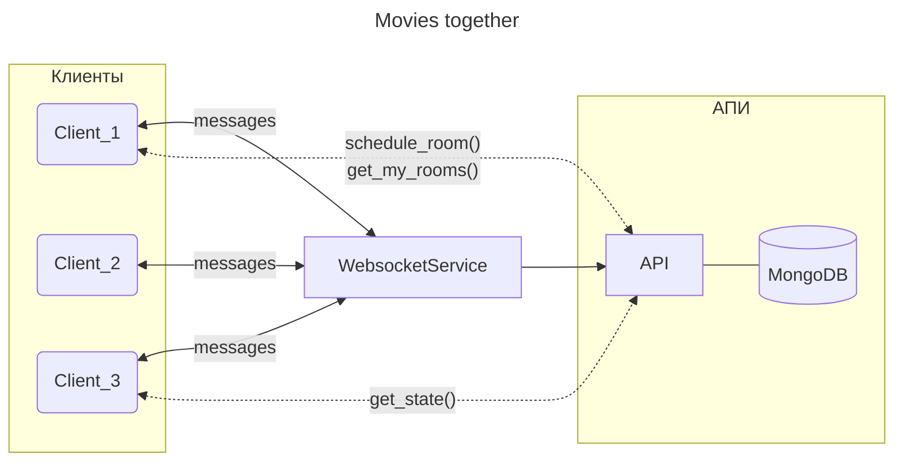
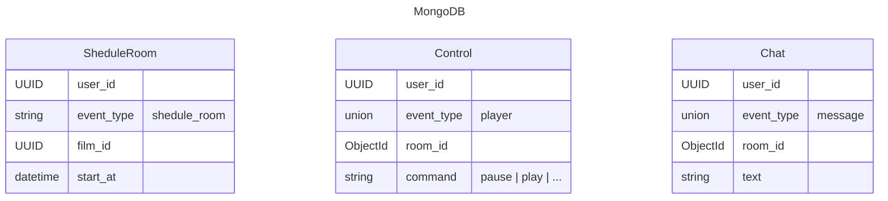
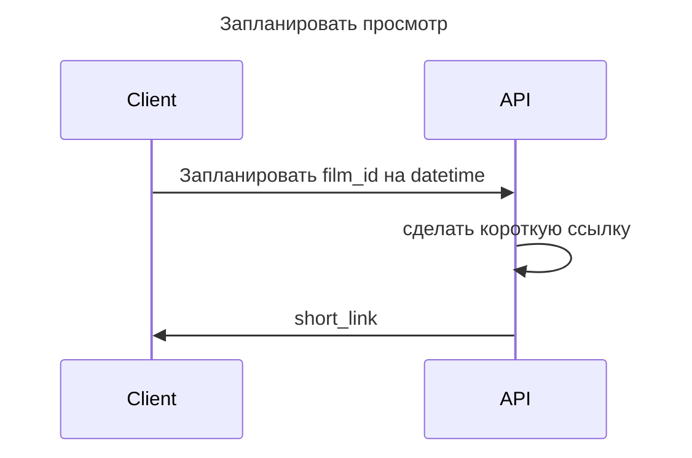
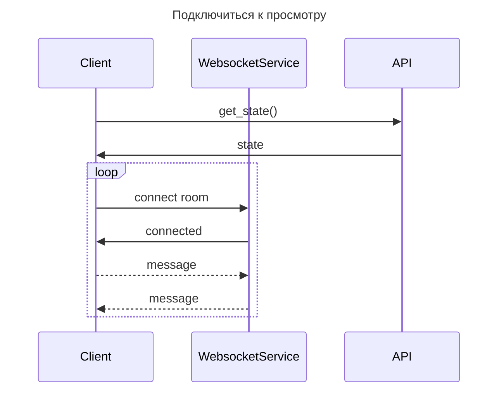

```mermaid
---
title: Movies together
---
flowchart LR
  subgraph Клиенты
  client_1(Client_1)
  client_2(Client_2)
  client_3(Client_3)
  end
  subgraph АПИ
  API[API] --- MongoDB[(MongoDB)]
  end
  WS[WebsocketService]
  
  client_1 & client_2 & client_3 <--messages--> WS
  client_3 <-..->|"get_state()"|API
  client_1 <-..->|"schedule_room()\nget_my_rooms()"|API

  
  WS --> API
```

```mermaid
---
title: MongoDB
---
erDiagram

SheduleRoom {
  UUID user_id
  string event_type "shedule_room"

  UUID film_id
  datetime start_at
}

Control {
  UUID user_id
  union event_type "player"
  ObjectId room_id

  string command "pause | play | ..."
}

Chat {
  UUID user_id
  union event_type "message"
  ObjectId room_id

  string text
}


```

```mermaid
---
title: Запланировать просмотр
---
sequenceDiagram
  participant Client
  participant API
  Client->>API: Запланировать film_id на datetime
  API->>API: сделать короткую ссылку
  API->>Client: short_link


```

```mermaid
---
title: Подключиться к просмотру
---
sequenceDiagram
  participant Client
  participant WebsocketService
  participant API

  Client->>API: get_state()
  API->>Client: state
  loop
    Client->>WebsocketService: connect room
    WebsocketService->>Client: connected
    Client-->>WebsocketService: message
    WebsocketService-->>Client: message
  end

```