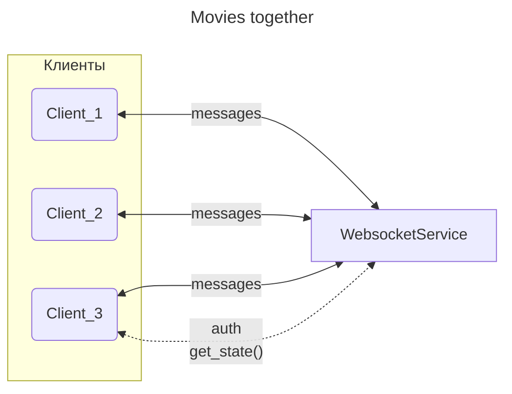
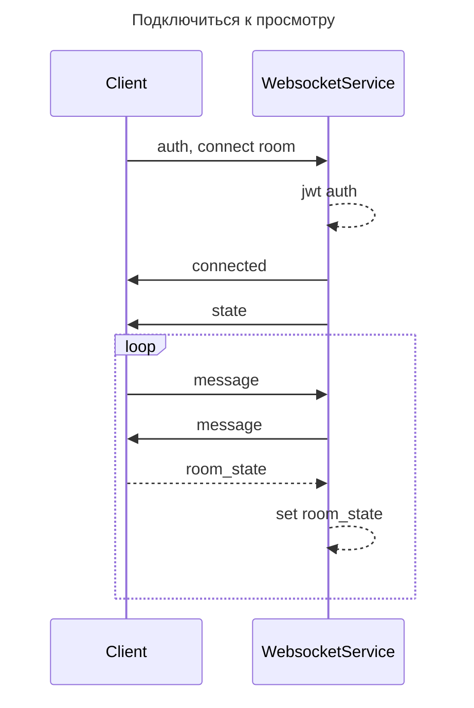

```mermaid
---
title: Movies together
---
flowchart LR
  subgraph Клиенты
  client_1(Client_1)
  client_2(Client_2)
  client_3(Client_3)
  end
  WS[WebsocketService]
  
  client_1 & client_2 & client_3 <--messages--> WS
  client_3 <-..->|"auth\nget_state()"|WS

  
  
```

```mermaid
---
title: Подключиться к просмотру
---
sequenceDiagram
  participant Client
  participant WebsocketService

  Client->>WebsocketService: auth, connect room
    WebsocketService-->>WebsocketService: jwt auth
  WebsocketService->>Client: connected
  WebsocketService->>Client: state 
  loop
    Client->>WebsocketService: message
    WebsocketService->>Client: message
    Client-->>WebsocketService: room_state
    WebsocketService-->>WebsocketService: set room_state
  end

```