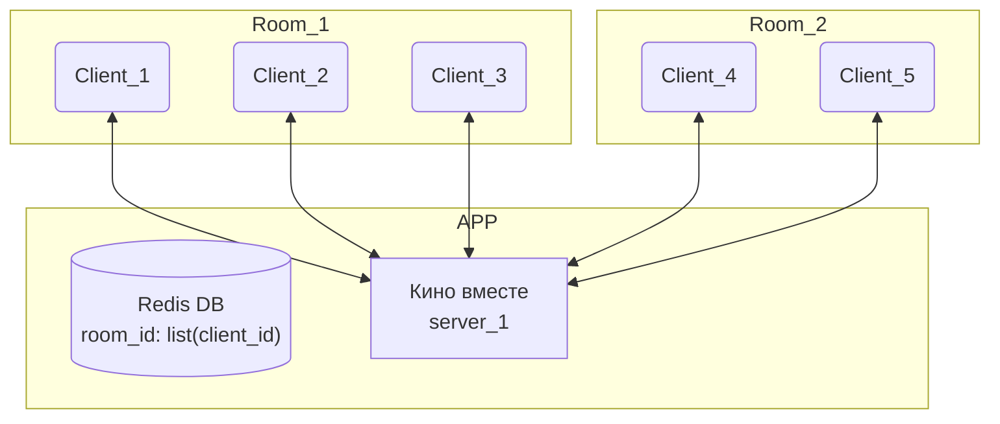
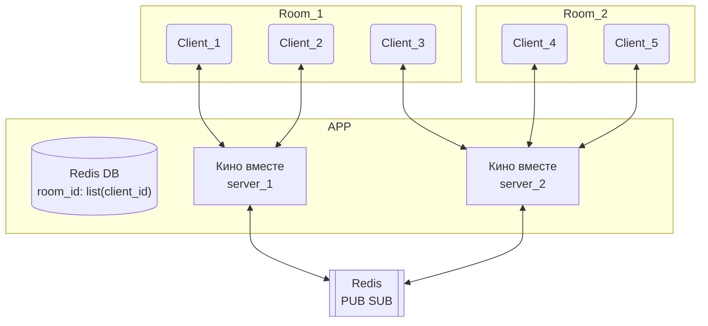

# 1. Только один сервер

# 2. Масштабируемся

Клиенты из одного рума могут оказаться на разных серверах,  
поэтому ставим PUB/SUB на который подписываем каждый север.

Но, почему-то мне кажется, мы можем считать, что рум для "кино вместе" всегда можно уместить на одном сервере.
Чтобы рум не поместился на одном сервере должно быть много тысяч клиентов в этом руме.

Похоже, нам достаточно реализовать только первый вариант.

