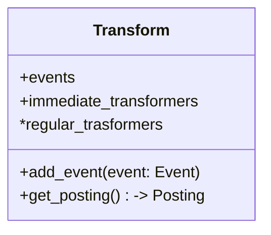

# Задачи

* Auth должен производить event в топик Kafka.
* ETL:
  * Extractor() читает сообщения из топика Kafka.
    * .extract() -> UserWelcomeEvent(pydantic.BaseModel)
  * UserWelcomeTransformer.make_postings(event: Event) -> AsyncGenerator(Posting)
    * EmailPosting(Posting),
    * Posting(Protocol)
  * MarketingMailingTransformer.make_postings(event: Event) -> AsyncGenerator(Posting)
  * Loader.load(posting: Posting)
* Worker
  * EmailSender.send(posting: EmailPosting) # Пишет в лог.

```python
async def main():
  extractor = Extractor()
  transform = Transform()
  loader = Load()
  while True:
    event = await extractor.extract()
    transform.add_event(event)
    posting = await transform.get_posting()
    await loader.load(posting)
```



# А еще нужно

* Получать короткие ссылки.
* Приоритетность отправлений.

## Тикеты

```
notifications/
  etl/
    Dockerfile
    src/
      extractor/
      loader/
      main.py
    tests/
  worker/
    Dockerfile
    src/
      senders/
      consumer/
    tests/
      unit/
        src/
          extractor/
            test_kafka_extractor.py
          loader/
            test_rabbitmq_loader.py
  docker-compose.yml
```


1) Auth должен производить event в топик Kafka.
2) Написать Extractor из Kafka.
3) Написать как Loader и Worker работает с сообщением.
4) Написать UserWelcomeTransformer и EmailSender

