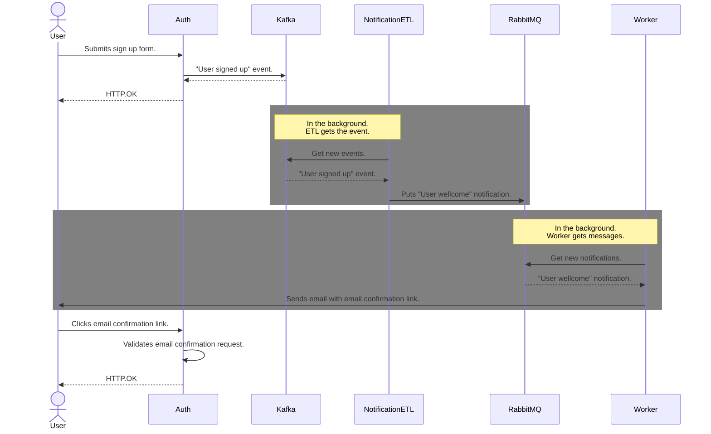

```mermaid
sequenceDiagram
    actor User
    
    User ->> Auth: Submits sign up form.
    Auth ->> Kafka: "User signed up" event.
    Kafka -->> Auth: 
    Auth -->> User: HTTP.OK
    
    rect grey
        Note over NotificationETL,Kafka: In the background.<br/>ETL gets the event.
        NotificationETL ->> Kafka: Get new events. 
        Kafka -->> NotificationETL: "User signed up" event.
        NotificationETL ->> RabbitMQ: Puts "User wellcome" notification.
    end
    rect grey       
        Note over Worker,RabbitMQ: In the background.<br/>Worker gets messages.
        Worker ->> RabbitMQ: Get new notifications.
        RabbitMQ -->> Worker: "User wellcome" notification.
        Worker ->> User: Sends email with email confirmation link.
    end
    
    User ->> Auth: Clicks email confirmation link.
    Auth ->> Auth: Validates email confirmation request.
    Auth -->> User: HTTP.OK 
```
