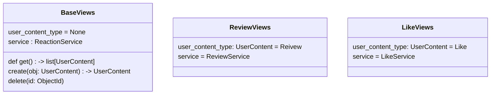

```python

class BaseViews {
    user_content_type = None
    service : ReactionService
    
    @router.get('')
    def get() -> list[UserContent]
    
    @router.post('')
    create(obj: UserContent) -> UserContent
    
    @router.delete('{id}')
    delete(id: ObjectId)
}
    
@cbv(router) 
class LikeViews {
    user_content_type: UserContent = Like
    service = LikeService
}
    
app.include_router(
    router, prefix='/api/v1/likes/',
    router, prefix='/api/v1/reivews/',
)
```

