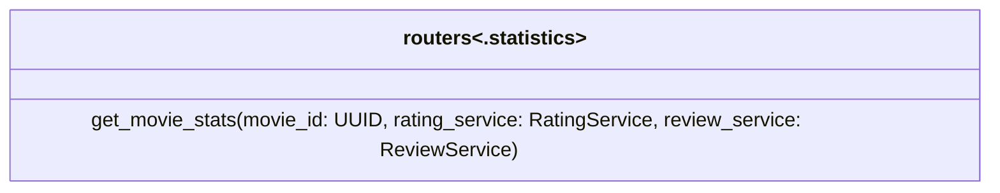
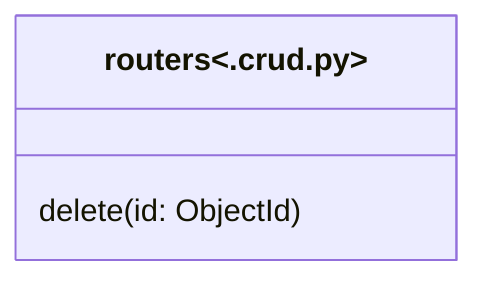
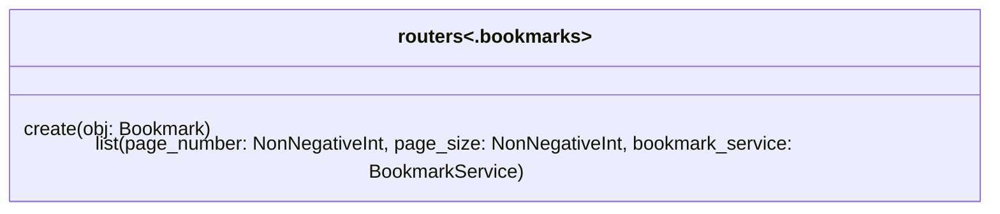
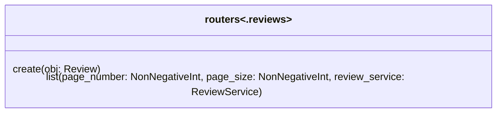
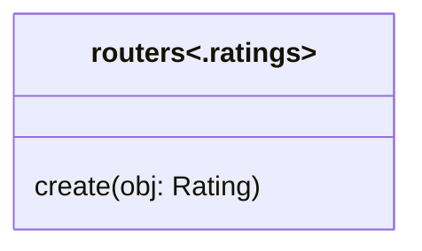
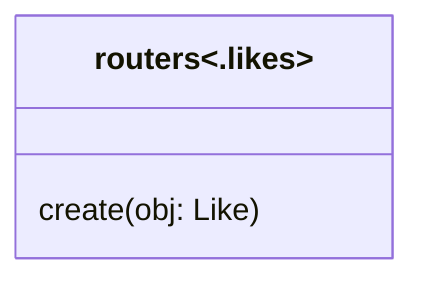

```mermaid
classDiagram
class routers~.statistics~ {
    get_movie_stats(movie_id: UUID, rating_service: RatingService, review_service: ReviewService)
}
```

```mermaid
classDiagram
class routers~.crud.py~ {
    delete(id: ObjectId)
}
```

```mermaid
classDiagram
class routers~.bookmarks~ {
    create(obj: Bookmark)
    list(page_number: NonNegativeInt, page_size: NonNegativeInt, bookmark_service: BookmarkService)
}
```

```mermaid
classDiagram
class routers~.reviews~ {
    create(obj: Review)
    list(page_number: NonNegativeInt, page_size: NonNegativeInt, review_service: ReviewService)
}
```

```mermaid
classDiagram
class routers~.ratings~ {
    create(obj: Rating)
}
```

```mermaid
classDiagram
class routers~.likes~ {
    create(obj: Like)
}
```
