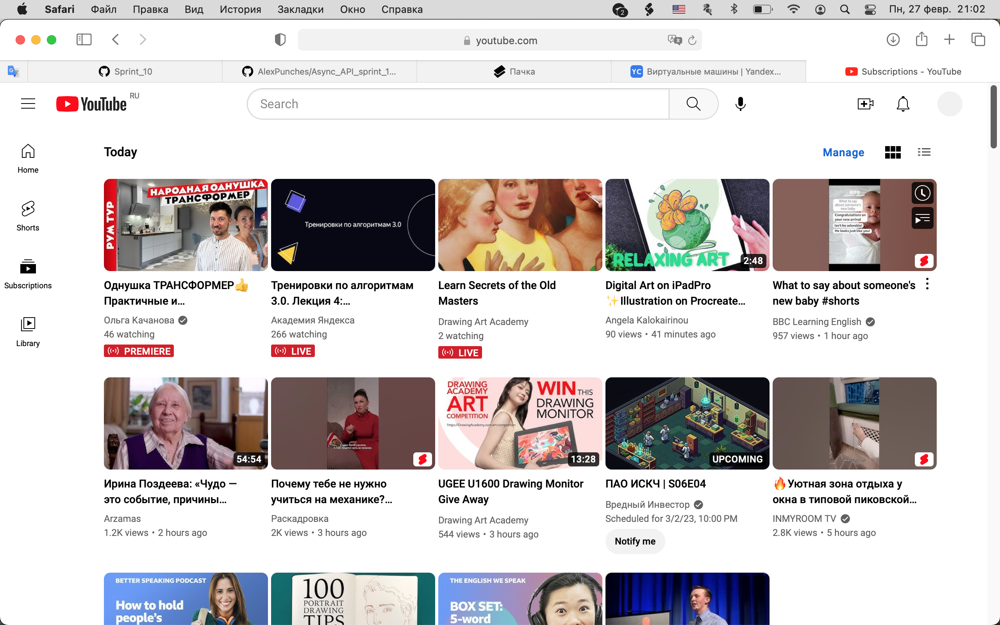

# Идеи для сервиса

- UI. Счетчик обратного отсчета.
- Запланированная трансляция, как на YouTube.
- Короткая ссылка в ответ на дату/время просмотра.

## Дружеская компания

- Кнопка "Найти компанию". На базе дружбы в соцсетях.
- Чат-рум, чтобы договориться о сеансе просмотра с друзьями.

## Модерация чата

Инициатор совместного просмотра может иметь права
ограничивать список участников чата. Приглашать или
удалять участников.

## Отображение реакций из чата на экране телевизора

На экране телевизора могут появляться личные сообщения
пользователю из чата.  Или сообщения, где его тэгнули. 
Другой вариант: на экране телевизора появляются эмоджи,
реакции от зрителя.

## Блоггеры и монетизация

- Синхронизированное управление для плеера. Один ведущий, 
остальные ведомые.
- Чат-рум лайв-стрима.
- Звуковые комментарии ведущего. Блоггинг. Как CinemaTherapy
и подобные реакции на кино.

 

### Денежные отношения

Продавать право на комментарий за пожертвование.
Платная подписка на блог.

## Отображение совместных просмотров в истории просмотров

## Уведомления

О предстоящих просмотрах. Он начале просмотра.