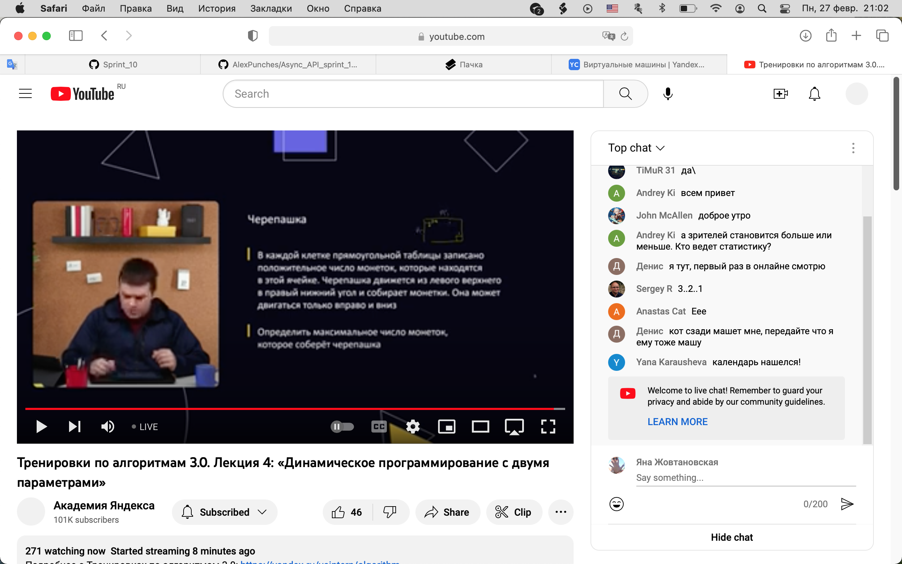

# Идеи для сервиса

- UI. Счетчик обратного отсчета.
- Запланированная трансляция, как на YouTube.
- Короткая ссылка в ответ на дату/время просмотра.

## Дружеская компания

- Кнопка "Найти компанию". На базе дружбы в соцсетях.
- Чат-рум, чтобы договориться о сеансе просмотра с друзьями.

## Блоггеры и монетизация

- Синхронизированное управление для плеера. Один ведущий, 
остальные ведомые.
- Чат-рум лайв-стрима.
- Звуковые комментарии ведущего. Блоггинг. Как CinemaTherapy
и подобные реакции на кино.

 

